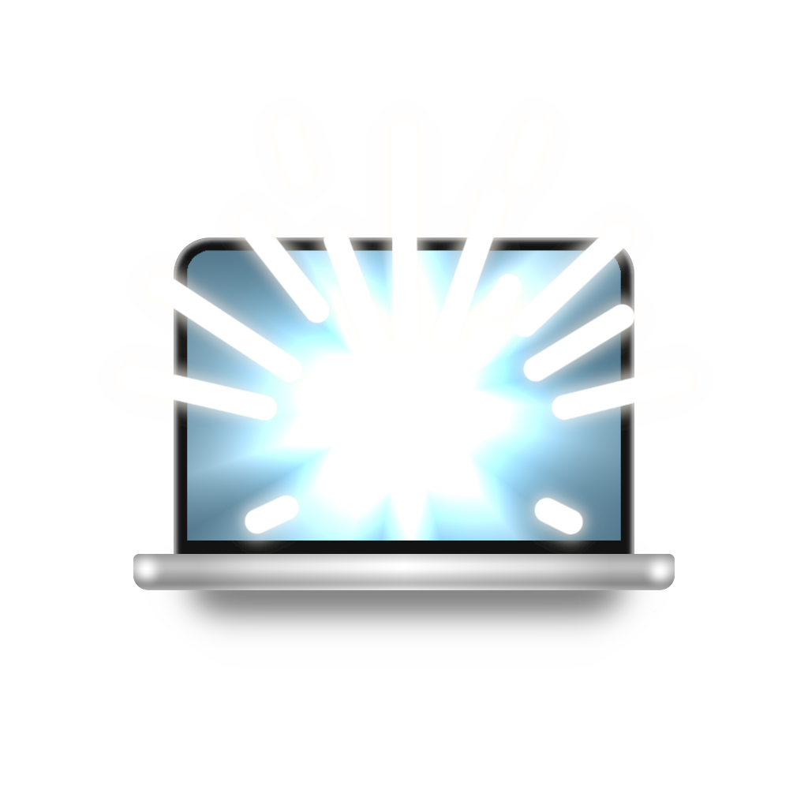
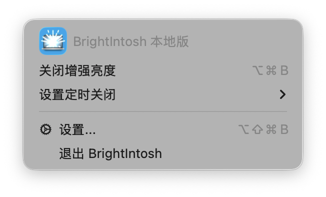
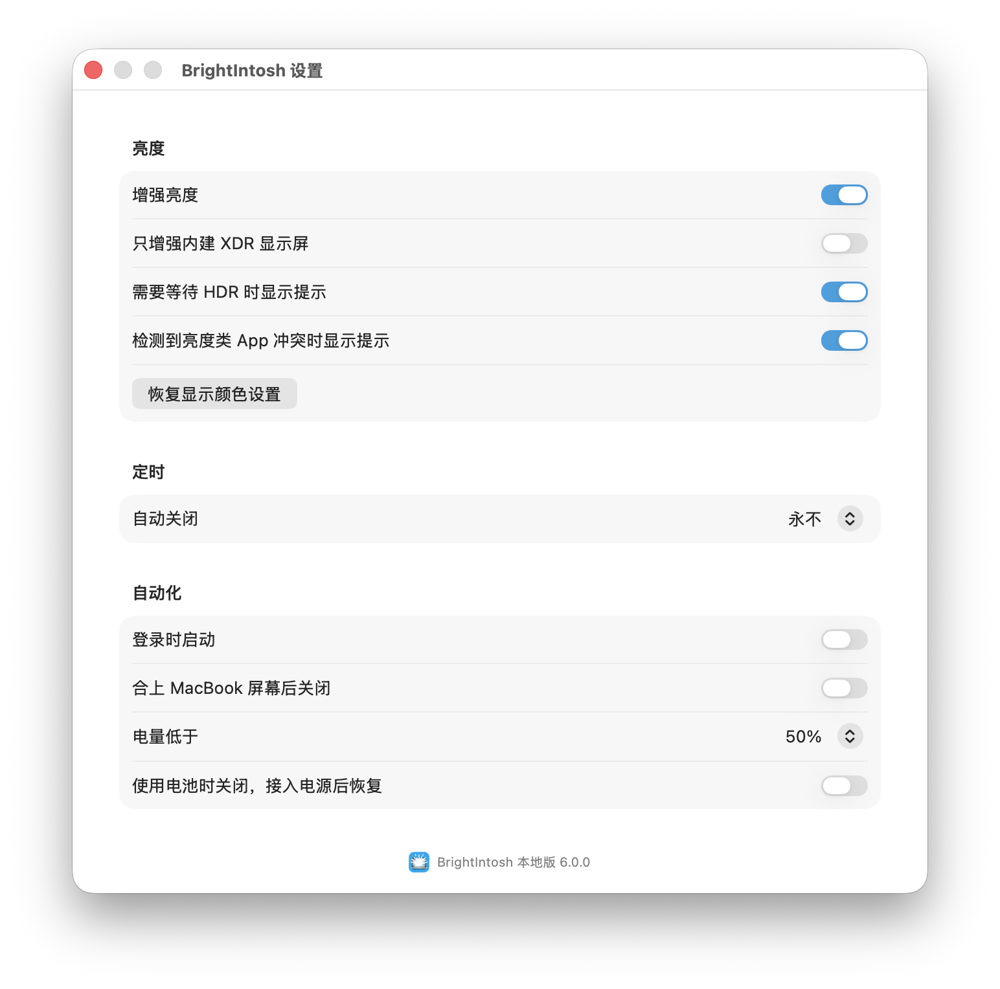

# BrightIntosh Local

<p align="center">
  
</p>

<h3 align="center">让旧款 XDR MacBook Pro 也能接近新款 1000 nits SDR 高亮体验。</h3>

<p align="center">
  适用于 M1 / M2 / M3 Pro 与 Max 机型。中文界面。菜单栏常驻。本地构建。
</p>

<p align="center">
  <a href="https://github.com/ReffWu/BrightIntosh-Local/releases/download/local-v6.0.0-zh.1/BrightIntosh-Local-6.0.0-zh.1.dmg">
    
  </a>
  <a href="https://github.com/ReffWu/BrightIntosh-Local/releases/tag/local-v6.0.0-zh.1">
    
  </a>
</p>

<p align="center">
  <a href="#安装">安装</a>
  ·
  <a href="#功能">功能</a>
  ·
  <a href="#支持设备">支持设备</a>
  ·
  <a href="#许可和来源">许可和来源</a>
</p>

<p align="center">
  
</p>

## 预览

BrightIntosh Local 把常用操作留在菜单栏，把完整配置放进一个接近 macOS 系统设置风格的窗口里。

<p align="center">
  
</p>

## 为什么需要它

Apple 的技术规格里，2021 年 M1 Pro / Max 和 2023 年 M2 Pro / Max MacBook Pro 的 Liquid Retina XDR 显示屏都具备 1000 nits 全屏持续 XDR 亮度和 1600 nits 峰值 HDR 亮度，但普通 SDR 亮度标称为 500 nits；2023 年 M3 Pro / Max 机型的 SDR 亮度标称为 600 nits。新款 M4 / M5 MacBook Pro 则标出户外 SDR 最高 1000 nits。

BrightIntosh Local 的目标，就是让这些旧款 XDR 机型在日常 SDR 使用中也能调用更高亮度范围，获得更接近新款机型的高亮体验。

参考：

- [MacBook Pro 16-inch 2021 技术规格](https://support.apple.com/en-is/111901)
- [MacBook Pro 14-inch 2023 M2 技术规格](https://support.apple.com/en-us/111340)
- [MacBook Pro 16-inch 2023 M3 Pro / Max 技术规格](https://support.apple.com/en-us/117737)
- [MacBook Pro 14-inch M4 2024 技术规格](https://support.apple.com/en-us/121552)
- [MacBook Pro 14-inch M5 2025 技术规格](https://support.apple.com/en-us/125405)

## 功能

- 一键开启或关闭 XDR 增强亮度
- 原生 macOS 风格中文设置窗口
- 定时关闭增强亮度
- 登录启动、电量阈值、接入电源和合盖自动化
- 全局快捷键
- 本地命令行控制
- 诊断报告复制
- 一键恢复显示颜色设置

## 安装

推荐直接下载 DMG：

```text
https://github.com/ReffWu/BrightIntosh-Local/releases/download/local-v6.0.0-zh.1/BrightIntosh-Local-6.0.0-zh.1.dmg
```

打开 DMG 后，把 `BrightIntosh.app` 拖进 `Applications`。

也可以从源码构建。

需要 macOS 和完整 Xcode。

```sh
./scripts/build-local.sh
```

脚本会完成 Release 构建、ad-hoc 签名，并安装到：

```text
/Applications/BrightIntosh.app
```

打开 App：

```sh
open /Applications/BrightIntosh.app
```

## 命令行

在 App 中打开：

```text
设置 -> 本地工具 -> 安装命令行工具...
```

安装后可使用：

```sh
brightintosh status
brightintosh enable
brightintosh disable
brightintosh toggle
brightintosh help
```

CLI 需要 BrightIntosh 主程序正在运行。

## 本地版改动

- Bundle ID: `local.reff.brightintosh`
- App Group: `group.local.reff.brightintosh`
- 默认不自动开启增强亮度
- 去掉商店、官网、帮助、社交和营销入口
- 设置窗口、菜单栏、首次启动页、提示和 CLI 文案改为中文
- CLI 和小组件通过分布式通知同步运行中的主 App
- 本地诊断报告跳过 StoreKit 检查

## 支持设备

- MacBook Pro M5 from 2025 / 2026: `Mac17,2`, `Mac17,6`, `Mac17,7`, `Mac17,8`, `Mac17,9`
- MacBook Pro M4 from 2024: `Mac16,1`, `Mac16,5`, `Mac16,6`, `Mac16,7`, `Mac16,8`
- MacBook Pro M3 from 2023: `Mac15,3`, `Mac15,6`, `Mac15,7`, `Mac15,8`, `Mac15,9`, `Mac15,10`, `Mac15,11`
- MacBook Pro M2 14" / 16" from 2023: `Mac14,5`, `Mac14,6`, `Mac14,9`, `Mac14,10`
- MacBook Pro M1 14" / 16" from 2021: `MacBookPro18,1`, `MacBookPro18,2`, `MacBookPro18,3`, `MacBookPro18,4`
- Pro Display XDR
- Studio Display XDR experimental

## 注意

长时间使用高亮度可能增加耗电和发热。macOS 仍会控制显示系统的保护策略，但请按实际环境使用。

已知限制：

- 与 f.lux 等会调节显示器亮度或颜色的 App 可能互相影响
- 开启增强亮度时，部分 HDR 视频可能出现高光裁剪
- 本地构建使用 ad-hoc 签名，不等同于 App Store 分发版本

## 许可和来源

本项目基于 [niklasr22/BrightIntosh](https://github.com/niklasr22/BrightIntosh) 修改，继续遵循原项目的 GPL-3.0 license。原始版权和许可证见 [LICENSE](LICENSE)。
